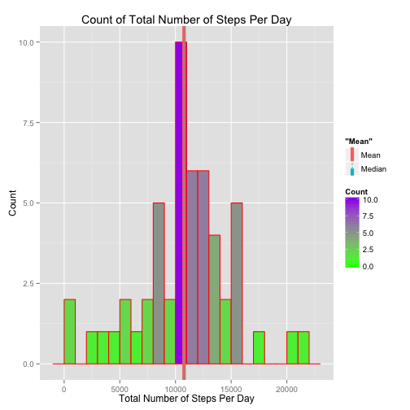
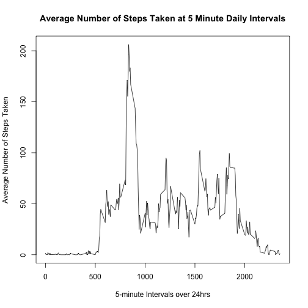
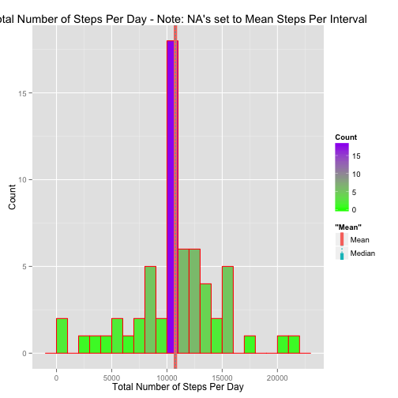
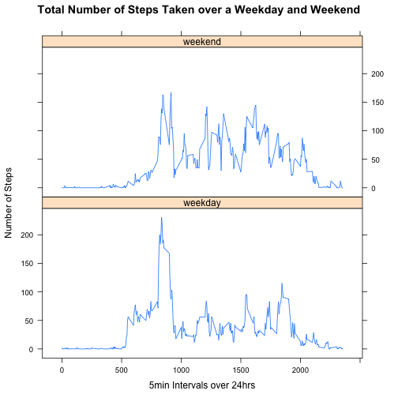

## Install Packages


## Set global options

Make all R Code chunks visible


```r
        opts_chunk$set(echo=TRUE)
```

## Loading and preprocessing the data

###### Note, I'm using the 'csv' file from the cloned github repository, as opposed to that from the [original link][1] provided. I assume both point to same data.
[1]: https://d396qusza40orc.cloudfront.net/repdata%2Fdata%2Factivity.zip "original link"


```r
        dataSet <- tbl_df(read.csv(unz("activity.zip", "activity.csv")))
        str(dataSet)
```

```
## Classes 'tbl_df', 'tbl' and 'data.frame':	17568 obs. of  3 variables:
##  $ steps   : int  NA NA NA NA NA NA NA NA NA NA ...
##  $ date    : Factor w/ 61 levels "2012-10-01","2012-10-02",..: 1 1 1 1 1 1 1 1 1 1 ...
##  $ interval: int  0 5 10 15 20 25 30 35 40 45 ...
```


```r
        summary(dataSet)
```

```
##      steps                date          interval     
##  Min.   :  0.00   2012-10-01:  288   Min.   :   0.0  
##  1st Qu.:  0.00   2012-10-02:  288   1st Qu.: 588.8  
##  Median :  0.00   2012-10-03:  288   Median :1177.5  
##  Mean   : 37.38   2012-10-04:  288   Mean   :1177.5  
##  3rd Qu.: 12.00   2012-10-05:  288   3rd Qu.:1766.2  
##  Max.   :806.00   2012-10-06:  288   Max.   :2355.0  
##  NA's   :2304     (Other)   :15840
```

## What is mean total number of steps taken per day?
###### Note: As per assignment instructions, ignoring missing values in the dataset.

1. **Calculate the total number of steps per day**

```r
        removed_NA_DS <- na.omit(dataSet) ## Remove NA's from dataset
        ## Groupby 'date' and get the sum of steps for that day
        stepsPerDay_DS <- summarise(group_by(removed_NA_DS, date), 
                                    total=sum(steps))
        str(stepsPerDay_DS$total)
```

```
##  int [1:53] 126 11352 12116 13294 15420 11015 12811 9900 10304 17382 ...
```

2. **Make a histogram of the total number of steps taken each day**


```r
        ## Using ggplot to create histogram
        ggplot(data=stepsPerDay_DS, aes(stepsPerDay_DS$total)) + 
        geom_histogram( binwidth=1000,
                       col="red",
                       aes(fill=..count..)) +
        scale_fill_gradient("Count", low = "green", high = "purple") +
        labs(title="Count of Total Number of Steps Per Day") +
        labs(x= "Total Number of Steps Per Day", y= "Count") +
        ## Draw line for mean
        geom_vline(aes(xintercept = mean(stepsPerDay_DS$total), color="Mean", 
                   linetype = "Mean"), size=2, show_guide = TRUE) +
        ## Draw line for median
        geom_vline(aes(xintercept = median(stepsPerDay_DS$total),color="Median", 
                       linetype = "Median"), show_guide = TRUE)
```

 

3. **Calculate and report the mean of the total number of steps taken per day**
 

```r
        meanNARemoved <- mean(stepsPerDay_DS$total)
        print(meanNARemoved)
```

```
## [1] 10766.19
```

4. **Calculate and report the median of the total number of steps taken per day**
 

```r
        medianNARemoved <- median(stepsPerDay_DS$total)
        print(medianNARemoved)
```

```
## [1] 10765
```

## What is the average daily activity pattern?

1. Make a time series plot (i.e. type = "l") of the 5-minute interval (x-axis) and the average number of steps taken, averaged across all days (y-axis)


```r
        ## Group the data by interval and calculate the mean for each interval
        timeSeries_DS <- summarise(group_by(removed_NA_DS, interval), 
                                   meanStepsPerInterval=mean(steps))
        ## Plot the data
        plot(timeSeries_DS$interval, 
             timeSeries_DS$meanStepsPerInterval, type="l",
             main="Average Number of Steps Taken at 5 Minute Daily Intervals",
             xlab="5-minute Intervals over 24hrs", 
             ylab="Average Number of Steps Taken")
```

 

2. Which 5-minute interval, on average across all the days in the dataset, contains the maximum number of steps?


```r
        maxNumSteps_DS <- 
                timeSeries_DS[which(timeSeries_DS$meanStepsPerInterval == 
                                    max(timeSeries_DS$meanStepsPerInterval)),]
        maxNumSteps_DS$interval
```

```
## [1] 835
```

## Imputing missing values

1. Calculate and report the total number of missing values in the dataset (i.e. the total number of rows with NAs)?


```r
        length(which(is.na(dataSet)))
```

```
## [1] 2304
```

2. Devise a strategy for filling in all of the missing values in the dataset. The strategy does not need to be sophisticated. For example, you could use the mean/median for that day, or the mean for that 5-minute interval, etc.?

Strategy: NA's will be replaced with the mean for that 5-minute interval, which was calculated above in dataset 'timeSeries_DS'. Below are details for accomplishing this:

- Iterate over 'dataSet' looking for steps=NA
- If steps=NA, get the dataSet$interval value for that row
- Look in timeSeries_DS for that 'interval' value
- When found, get it's corresponding 'meanStepsPerInterval' value
- Set 'steps=meanStepsPerInterval'

I believe, this is the best way to estimate what 'NA' values are. Example: ON AVERAGE, chances are a person does the same thing every night at 4AM (interval = 400). 

3. Create a new dataset that is equal to the original dataset but with the missing data filled in.


```r
        func <- function(dataSet, timeSeries_DS) {
                if (is.na(dataSet["steps"])) { ## If true
                        ## Get 'mean' for current '5 min' interval
                        result <- timeSeries_DS[which(timeSeries_DS$interval ==
                                                      dataSet[["interval"]]), 
                                                c(FALSE, TRUE)]
                        ## Replace 'steps=NA' with 'steps = meanStepsPerInterval'-For given 5min Interval
                        dataSet[["steps"]] <- as.integer(round(result$meanStepsPerInterval))
                }
                dataSet
        }
        ## Iterate over the dataframe and return dataset where 'NA's' have been replaced with mean for that 5 minute interval
        naSet_DS <- by(dataSet, 1:nrow(dataSet), func, timeSeries_DS)
        naSet_DS <- do.call(rbind, naSet_DS)
```

Verify there are no 'NA's' in new dataset (FALSE implies none)?


```r
        anyNA(naSet_DS)
```

```
## [1] FALSE
```

Display the 'steps' value for the first 288 rows. These values were originally equal to 'NA'


```r
        naSet_DS$steps[1:288]
```

```
##   [1]   2   0   0   0   0   2   1   1   0   1   0   0   0   1   0   0   0
##  [18]   1   2   0   0   0   0   0   0   0   1   0   0   0   0   0   0   0
##  [35]   2   1   0   0   0   0   0   1   2   1   0   0   0   0   1   1   3
##  [52]   0   0   0   4   1   3   1   3   1   0   2   3   2   3   3   2   6
##  [69]  16  18  39  44  31  49  54  63  50  47  52  39  44  44  37  49  44
##  [86]  44  51  55  50  51  56  44  52  70  58  56  73  68 129 158 171 155
## [103] 177 206 196 180 183 167 143 124 109 108 104  96  66  45  25  39  35
## [120]  21  41  27  42  53  39  51  44  37  35  28  25  32  31  30  21  26
## [137]  28  26  33  50  42  45  46  59  64  88  95  93  63  50  54  32  27
## [154]  38  45  67  42  40  43  41  46  56  43  25  40  54  47  61  56  52
## [171]  44  49  35  38  42  28  17  26  44  44  30  36  35  39  46  48  48
## [188]  65  83  99 102  84  62  64  75  63  57  60  44  39  45  45  46  44
## [205]  47  56  51  61  73  79  69  60  75  57  35  37  41  58  75  85  59
## [222]  68  78  74  85  99  87  86  85  78  58  53  36  21  27  40  30  26
## [239]  46  34  20  19  19  33  27  21  27  21  20  21  32  20  16  17  23
## [256]  19  12   8  15  16   9   8   8   3   1   4   5   9   7   9  10   2
## [273]   0   0   2   5   3   3   0   1   1   2   3   5   3   1   0   1
```

4.1. Make a histogram of the total number of steps taken each day?


```r
        naSet_StepsPerDay_DS <- summarise(group_by(naSet_DS, date), 
                                    total=sum(steps))

        ggplot(data=naSet_StepsPerDay_DS, aes(naSet_StepsPerDay_DS$total)) + 
        geom_histogram(binwidth=1000, col="red", aes(fill=..count..)) +
        scale_fill_gradient("Count", low = "green", high = "purple") +
        labs(title="Total Number of Steps Per Day - Note: NA's set to Mean Steps Per Interval") +
        labs(x= "Total Number of Steps Per Day", y= "Count") +
        ## Draw line for mean
        geom_vline(aes(xintercept = mean(naSet_StepsPerDay_DS$total), 
                       color="Mean", linetype = "Mean"), 
                   size=2, show_guide = TRUE) +
        ## Draw line for median
        geom_vline(aes(xintercept = median(naSet_StepsPerDay_DS$total), 
                       color="Median", linetype = "Median"), show_guide = TRUE)
```

 

4.2. Calculate and report the mean total number of steps taken per day?


```r
        meanNASet <- mean(naSet_StepsPerDay_DS$total)
        print(meanNASet)
```

```
## [1] 10765.64
```

4.3. Calculate and report the median total number of steps taken per day?
 

```r
        medianNASet <- median(naSet_StepsPerDay_DS$total)
        print(medianNASet)
```

```
## [1] 10762
```

4.4. Do these values differ from the estimates from the first part of the assignment?

- First 'Mean' estimate was **10766.19** and this estimate is **10765.64**. 
- First 'Median' estimate was **10765.00** and this estimate is **10762.00**.

So, I would say the difference is minute for both.

4.5. What is the impact of imputing missing data on the estimates of the total daily number of steps? There is no real impact.


## Are there differences in activity patterns between weekdays and weekends?

1. Create a new factor variable in the dataset with two levels – “weekday” and “weekend” indicating whether a given date is a weekday or weekend day.


```r
        ## Covert 'date' factor variable to type date
        dates <- as.Date(naSet_DS$date, format = "%Y-%m-%d")
        days <- weekdays(dates) ## Get day of week
        ## Is date a weekend day
        isWeekend <- days %in% c("Saturday", "Sunday")
        ## Convert to factor
        weekdayOrWeekend <- factor(isWeekend)
        ## False implies it's a "weekday"
        levels(weekdayOrWeekend)[1] <- "weekday"
        ## True implies it's a "weekend day"
        levels(weekdayOrWeekend)[2] <- "weekend"
        ## Create new dataset where 'NA's' are set to 5min interval mean and
        ## a new column that tells you if the 'date' is 'weekday' or 'weekend' 
        weekdayOrWeekend_DS <- cbind(naSet_DS, weekdayOrWeekend)
        str(weekdayOrWeekend_DS)
```

```
## 'data.frame':	17568 obs. of  4 variables:
##  $ steps           : int  2 0 0 0 0 2 1 1 0 1 ...
##  $ date            : Factor w/ 61 levels "2012-10-01","2012-10-02",..: 1 1 1 1 1 1 1 1 1 1 ...
##  $ interval        : int  0 5 10 15 20 25 30 35 40 45 ...
##  $ weekdayOrWeekend: Factor w/ 2 levels "weekday","weekend": 1 1 1 1 1 1 1 1 1 1 ...
```

2. Make a panel plot containing a time series plot (i.e. type = "l") of the 5-minute interval (x-axis) and the average number of steps taken, averaged across all weekday days or weekend days (y-axis). See the README file in the GitHub repository to see an example of what this plot should look like using simulated data?


```r
        plot_DS <- weekdayOrWeekend_DS %>%
                   group_by(weekdayOrWeekend, interval) %>%
                   summarise(avg=mean(steps))
        xyplot(avg ~ interval | weekdayOrWeekend, data = plot_DS, 
               layout = c(1, 2), type = "l", xlab="5min Intervals over 24hrs", 
               ylab="Number of Steps", 
               main="Total Number of Steps Taken over a Weekday and Weekend")
```

 
